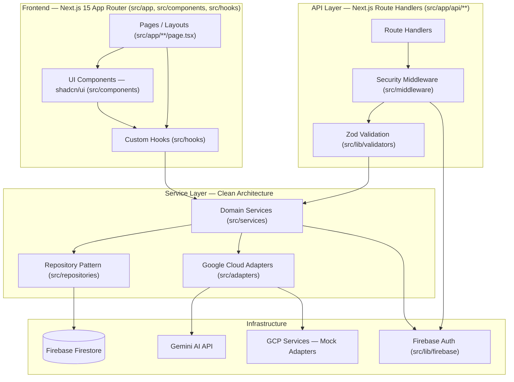
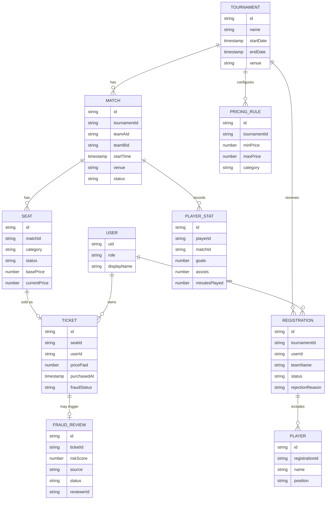

# Design Document: StadiumAI — Smart Stadiums & Tournament Operations

## Overview

This document describes the technical design for a production-grade Next.js 15 (App Router) platform implementing tournament operations, ticketing, and AI-driven stadium intelligence. The platform is a **single Next.js fullstack application** — there is no separate Express server. Cross-cutting concerns normally implemented as Express middleware (security headers, rate limiting, request validation) are implemented as Next.js middleware and API route wrapper functions instead.

The codebase is organized under a flat `/src` root (rather than the previous `/app`-relative module layout) using dedicated top-level folders for adapters, repositories, services, middleware, types, hooks, and utils. This section supersedes the architecture, folder structure, and component-location details of the prior design; the correctness properties and testing strategy below carry over unchanged in substance, with file paths updated to the new layout.

Firebase (Firestore/Auth/Storage) remains the backend of record, and a Gemini-backed AI layer with graceful mock fallback remains the reasoning engine for flagship and AI-driven features. Non-credentialable Google Cloud services (Maps, Vision, Speech-to-Text, Translate, Vertex AI, BigQuery, Cloud Scheduler, Cloud Tasks, Cloud Logging, Secret Manager) continue to be implemented via a uniform interface → adapter (mock) → factory pattern, now consolidated one-file-per-service under `/src/adapters`.

Implementation language: **TypeScript** (strict mode), detected as the dominant/required language for this Next.js 15 stack.

**Testing framework decision**: the platform uses **Vitest + React Testing Library + fast-check**, not Jest. Vitest integrates natively with the Vite-based tooling Next.js 15 relies on, and all 38 correctness properties below were already designed around fast-check running inside Vitest. Any reference to `jest.config.ts` in planning documents is superseded by `vitest.config.ts`.

## Architecture



### Layering (Clean Architecture within `/src`)

- **`/src/app`**: Route segments (pages) and Route Handlers (`/src/app/api/**/route.ts`). Thin: parse/validate request, call service, format response.
- **`/src/components`**: Reusable, presentation-focused UI (`ui/` shadcn/ui primitives, `layout/`, `stadium/`, `tournament/`, `tickets/`, `shared/`), no business logic.
- **`/src/hooks`**: Reusable React hooks composing services and Firestore realtime listeners.
- **`/src/services`**: Business logic. Orchestration functions/classes that call repositories, the Gemini adapter, and external adapters. No direct Firestore SDK calls outside repositories.
- **`/src/repositories`**: Firestore data access. `base.repository.ts` provides generic CRUD/query helpers over a Firestore collection; domain repositories extend/compose it.
- **`/src/adapters`**: One file per Google Cloud service (interface + mock implementation + factory), including `gemini.adapter.ts`.
- **`/src/lib`**: Cross-cutting infrastructure — Firebase client/admin/auth init (`firebase/`), Zod schemas (`validators/`), shared constants.
- **`/src/middleware`**: Rate limiting, auth/RBAC enforcement, and security headers, composed into a shared API route wrapper.
- **`/src/types`**: Shared TypeScript types/interfaces per domain area.
- **`/src/utils`**: Pure helper functions (formatting, error normalization, pagination math).
- **`__tests__`**: Vitest unit/property/integration tests mirroring `src/` structure.
- **`docs/`**: Architecture, API, deployment, contributing, and security documentation.
- **`firebase/`**: `firestore.rules`, `firestore.indexes.json`.

Dependency rule: `app (pages) → components → hooks → services → repositories/adapters → lib/firebase`. Route Handlers depend on `middleware → lib/validators → services`. Lower layers never import from higher layers.

## Folder Structure

```
stadium-ai/
├── .github/
│   ├── workflows/ci.yml
│   ├── ISSUE_TEMPLATE/{bug_report.md,feature_request.md}
│   └── pull_request_template.md
├── public/
├── src/
│   ├── app/
│   │   ├── layout.tsx
│   │   ├── page.tsx
│   │   ├── globals.css
│   │   ├── dashboard/page.tsx
│   │   ├── stadium/page.tsx
│   │   ├── tournament/page.tsx
│   │   ├── tickets/page.tsx
│   │   ├── registrations/page.tsx
│   │   ├── my-tickets/page.tsx
│   │   └── api/
│   │       ├── auth/session/route.ts
│   │       ├── stadium/
│   │       │   ├── route.ts
│   │       │   ├── emergency-route/[zoneId]/route.ts
│   │       │   ├── matches/[matchId]/seats/route.ts
│   │       │   ├── matches/[matchId]/seat-recommendations/route.ts
│   │       │   ├── matches/[matchId]/crowd-density/route.ts
│   │       │   └── matches/[matchId]/queue-predictions/route.ts
│   │       ├── tournament/
│   │       │   ├── route.ts
│   │       │   ├── [id]/route.ts
│   │       │   ├── [id]/matches/route.ts
│   │       │   ├── [id]/fixtures/generate/route.ts
│   │       │   ├── [id]/insights/route.ts
│   │       │   ├── matches/[matchId]/prediction/route.ts
│   │       │   ├── players/[playerId]/stats/route.ts
│   │       │   ├── registrations/route.ts
│   │       │   ├── registrations/[id]/route.ts
│   │       │   └── [id]/registrations/route.ts
│   │       ├── tickets/
│   │       │   ├── route.ts
│   │       │   ├── pricing/rules/route.ts
│   │       │   ├── pricing/dashboard/route.ts
│   │       │   ├── fraud/dashboard/route.ts
│   │       │   └── fraud/[id]/review/route.ts
│   │       ├── chat/route.ts
│   │       └── analytics/[tournamentId]/route.ts
│   ├── components/
│   │   ├── ui/            (shadcn/ui primitives)
│   │   ├── layout/         (Header, Sidebar, Footer, MobileNav)
│   │   ├── stadium/        (SeatMap, CrowdHeatmap, QueueStatus, EmergencyPanel)
│   │   ├── tournament/     (BracketView, FixtureList, PlayerCard, MatchPredictor)
│   │   ├── tickets/        (TicketCard, PricingChart, FraudAlert)
│   │   └── shared/         (ErrorBoundary, LoadingSkeleton, EmptyState)
│   ├── hooks/               (use-stadium, use-tournament, use-auth, use-theme, use-debounce, use-keyboard-nav, use-live-seat-map, use-live-fraud-feed)
│   ├── services/            (stadium.service.ts, tournament.service.ts, ticketing.service.ts, analytics.service.ts, chat.service.ts)
│   ├── repositories/        (base.repository.ts, stadium.repository.ts, tournament.repository.ts, ticket.repository.ts)
│   ├── adapters/            (gemini.adapter.ts, maps.adapter.ts, vision.adapter.ts, speech.adapter.ts, translate.adapter.ts, vertex-ai.adapter.ts, bigquery.adapter.ts, cloud-scheduler.adapter.ts, tasks.adapter.ts, logging.adapter.ts, secrets.adapter.ts)
│   ├── lib/
│   │   ├── firebase/{config.ts,admin.ts,auth.ts}
│   │   ├── validators/      (Zod schemas)
│   │   └── constants.ts
│   ├── middleware/          (rate-limiter.ts, auth.middleware.ts, security.ts, api-handler.ts)
│   ├── types/               (stadium.types.ts, tournament.types.ts, ticket.types.ts, api.types.ts)
│   └── utils/                (helpers.ts, formatters.ts, error-handler.ts)
├── __tests__/
│   ├── unit/{services,adapters,utils}/
│   ├── integration/api/
│   └── setup.ts
├── docs/{ARCHITECTURE.md,API.md,DEPLOYMENT.md,CONTRIBUTING.md,SECURITY.md}
├── firebase/{firestore.rules,firestore.indexes.json}
├── .env.example, .eslintrc.json, .prettierrc, Dockerfile, docker-compose.yml, vitest.config.ts, next.config.ts, tailwind.config.ts, tsconfig.json, package.json, LICENSE, README.md
```

**Coverage notes on the folder structure** (deviations from the raw plan, made to keep 100% requirements.md traceability):
- Added `vertex-ai.adapter.ts` and `cloud-scheduler.adapter.ts` to `/src/adapters` — Requirement 19.1 requires an interface for Vertex AI and Cloud Scheduler in addition to the eight adapters explicitly named in the plan.
- Added `src/app/api/auth/session/route.ts` — Requirement 1.1/1.2/1.7 require a session endpoint; it is grouped under `auth/` alongside the five named top-level API groups (`stadium`, `tournament`, `tickets`, `chat`, `analytics`).
- `stadium.repository.ts` provides venue/zone lookup data used by `EmergencyRoutingService` and `CrowdDensityService`; `tournament.repository.ts` additionally covers registrations and player stats (Requirements 4, 5, 17); `ticket.repository.ts` additionally covers pricing rules and fraud reviews (Requirements 7, 8).
- Every top-level API group (`stadium`, `tournament`, `tickets`, `chat`, `analytics`) is expanded into nested `route.ts` files so each distinct requirements.md endpoint has a concrete file, per the plan's instruction.
- `use-live-seat-map` and `use-live-fraud-feed` are added to `/src/hooks` for the realtime Firestore listeners needed by the live seat map (Req 3.4/23.4) and live fraud feed (Req 8.4).
- `registrations/page.tsx` and `my-tickets/page.tsx` are added under `/src/app` for user-facing registration and ticket-history views (Req 4.5, 6.4); admin-gated views (approval dashboard, pricing/fraud/insights dashboards) are nested client components under `dashboard/page.tsx`, role-gated at render time.

## Components and Interfaces

### 1. Auth & Session (`src/lib/firebase/auth.ts`, `src/middleware/auth.middleware.ts`)

```typescript
// src/lib/firebase/auth.ts
export interface SessionClaims {
  uid: string;
  role: "admin" | "user";
}

export interface AuthGateway {
  createSession(idToken: string): Promise<{ cookie: string; claims: SessionClaims }>;
  verifySession(cookie: string | undefined): Promise<SessionClaims | null>;
  requireRole(claims: SessionClaims | null, role: "admin" | "user"): void; // throws AuthorizationError
  revokeSession(cookie: string): Promise<void>;
}
```

Implemented using `firebase-admin/auth` `verifyIdToken` and `createSessionCookie`. Session cookie is httpOnly, `Secure`, `SameSite=Lax`. Custom claims (`role: "admin" | "user"`) default to `user` on account creation; admin promotion happens via a protected admin-only route/script.

`src/middleware/security.ts` (Next.js Edge middleware, `middleware.ts` at project root re-exporting it) applies security response headers (CSP, X-Content-Type-Options, X-Frame-Options, Referrer-Policy) to every response and performs a lightweight cookie-presence check for protected path prefixes. `src/middleware/auth.middleware.ts` performs the authoritative `verifySession` + `requireRole` check inside Route Handlers (Edge middleware cannot use `firebase-admin`).

### 2. Zod Contracts (`src/lib/validators/`)

Every Route Handler request/response is defined as a Zod schema with the TypeScript type inferred via `z.infer`:

```typescript
// src/lib/validators/tournament.validator.ts
export const CreateTournamentSchema = z.object({
  name: z.string().min(3).max(120),
  startDate: z.coerce.date(),
  endDate: z.coerce.date(),
  venue: z.string().min(2).max(120),
}).refine(d => d.endDate >= d.startDate, {
  message: "endDate must not be before startDate",
  path: ["endDate"],
});
export type CreateTournamentInput = z.infer<typeof CreateTournamentSchema>;
```

### 3. Rate Limiter (`src/middleware/rate-limiter.ts`)

```typescript
export interface RateLimiter {
  check(key: string): { allowed: boolean; remaining: number; resetAt: number };
}
```

In-memory sliding-window/token-bucket implementation keyed by IP+route. Documented header comment: "To scale horizontally, replace `InMemoryRateLimiter` with a `RedisRateLimiter` implementing the same `RateLimiter` interface, backed by Redis `INCR`+`EXPIRE` or a sorted set."

### 4. Repository Layer (`src/repositories/`)

`base.repository.ts` provides a generic, typed Firestore CRUD helper reused by every domain repository:

```typescript
// src/repositories/base.repository.ts
export interface BaseRepository<T> {
  create(data: T): Promise<string>;
  getById(id: string): Promise<T | null>;
  list(page: number, pageSize: number): Promise<{ items: T[]; total: number }>;
  update(id: string, patch: Partial<T>): Promise<void>;
  delete(id: string): Promise<void>;
}
```

- `tournament.repository.ts`: `TournamentRepository`, `MatchRepository`, `RegistrationRepository`, `PlayerStatRepository` (composed/exported from one module; tournaments, matches, registrations, and player stats are tournament-scoped aggregates).
- `ticket.repository.ts`: `SeatRepository`/`TicketRepository` (with a Firestore transactional `purchaseSeat` operation for atomicity, Requirement 6), `PricingRuleRepository`, `FraudReviewRepository`.
- `stadium.repository.ts`: `VenueZoneRepository` for static zone/exit map lookups used by emergency routing and crowd density.

### 5. Service Layer (`src/services/`)

- `tournament.service.ts` exports `TournamentService` (tournament/match CRUD, deletion gating), `RegistrationService` (self-registration + approval workflow), `SchedulerService` (round-robin fixture generation/regeneration), `MatchPredictionService` (Gemini-backed outcome prediction), `PlayerStatsService` (aggregation).
- `stadium.service.ts` exports `SeatRecommendationService`, `CrowdDensityService`, `QueuePredictionService`, `EmergencyRoutingService`.
- `ticketing.service.ts` exports `BookingService` (seat reservation/purchase, reservation-timeout sweeper), `PricingEngine` (flagship dynamic pricing), `FraudDetectionService` (flagship fraud detection).
- `chat.service.ts` exports `ChatbotService`.
- `analytics.service.ts` exports `InsightsService` (BigQuery-adapter-backed tournament/stadium analytics aggregation for the InsightsDashboard).

### 6. Gemini Adapter (`src/adapters/gemini.adapter.ts`)

```typescript
export interface GeminiRequest {
  prompt: string;
  context?: Record<string, unknown>;
}
export interface GeminiResponse {
  text: string;
  source: "gemini" | "mock";
}
export interface GeminiClient {
  generate(req: GeminiRequest): Promise<GeminiResponse>;
}
```

`GeminiAdapter` implements `GeminiClient`:
- If `process.env.GEMINI_API_KEY` is set, calls the real Gemini API (`@google/generative-ai`). On error/timeout, catches and falls through to the deterministic mock path (never throws to caller).
- If no key is set, immediately returns a deterministic mock response derived from a seeded hash of the prompt, labeled `source: "mock"`.

Each flagship/AI feature service builds a structured prompt via a co-located prompt-builder function within its own service file, calls `GeminiAdapter.generate`, and parses the response into a typed result, falling back to a documented heuristic function on parse failure or `source: "mock"` combined with a "strict mode" flag where relevant (pricing/fraud always compute the heuristic in parallel as a safety bound, per Req 7.2/7.3 and 8.2).

### 7. External Google Cloud Adapters (`src/adapters/`)

One file per service, each containing: the TypeScript interface, a `Mock*Adapter` class, and a factory function; every mock export carries a `/** MOCK IMPLEMENTATION */` doc comment describing the swap-in path to a real credentialed client.

```typescript
// src/adapters/maps.adapter.ts
export interface MapsRoute {
  steps: string[];
  distanceMeters: number;
  etaSeconds: number;
}
export interface MapsAdapter {
  getEvacuationRoute(zoneId: string, exitId: string): Promise<MapsRoute>;
}

/** MOCK IMPLEMENTATION — returns realistic synthetic routing data.
 * To go live: implement `MapsAdapter` using `@googlemaps/routing` with a
 * credentialed API key, mapping the Directions API response into `MapsRoute`. */
export class MockMapsAdapter implements MapsAdapter { /* ... */ }
export function createMapsAdapter(): MapsAdapter { return new MockMapsAdapter(); }
```

The same triad (interface, mock class, factory + doc comment) is applied in: `vision.adapter.ts` (crowd density image analysis), `speech.adapter.ts` (chatbot voice-input stub), `translate.adapter.ts` (chatbot i18n stub), `vertex-ai.adapter.ts` (alternate reasoning backend, documented as swappable with `GeminiAdapter`), `bigquery.adapter.ts` (InsightsService analytics warehouse), `cloud-scheduler.adapter.ts` (fixture-generation/reservation-sweep cron stub), `tasks.adapter.ts` (reservation-timeout sweep enqueue stub), `logging.adapter.ts` (structured log sink stub), `secrets.adapter.ts` (env/secret loader stub for `GEMINI_API_KEY` and Firebase Admin credentials).

### 8. UI Composition

- Server Components (`src/app/**/page.tsx`) fetch initial data directly via services for fast first paint.
- Client Components (`"use client"`) handle interactivity: seat selection, chat widget, dashboards with charts — all loaded via `next/dynamic` with `ssr: false` where charting libs are client-only.
- Firestore realtime listeners (`onSnapshot`) are used client-side in dedicated hooks (`use-live-seat-map`, `use-live-fraud-feed`) for live updates, layered on top of the initial server-fetched snapshot.
- `src/components/stadium/SeatMap.tsx` virtualizes seat rendering above a configurable threshold (e.g., 300 seats) using row-based virtualization, and supports full keyboard operation (arrow keys to move focus between seats, Enter/Space to select, Enter to confirm purchase in a confirmation dialog).

## Data Models



Firestore collections mirror the entities above (`tournaments`, `matches`, `registrations/{id}/players`, `seats` (subcollection of `matches`), `tickets`, `pricingRules`, `fraudReviews`, `playerStats`). Composite indexes are documented in `firebase/firestore.indexes.json` (e.g., `matches` by `tournamentId, startTime`; `registrations` by `tournamentId, status`; `tickets` by `userId, purchasedAt`; `fraudReviews` by `status, riskScore desc`).

## Error Handling

- All Route Handlers wrap logic in a shared `withApiHandler` helper (`src/middleware/api-handler.ts`) that:
  1. Validates the request via Zod (`safeParse`) → 400 with `{ error: "validation_error", details }` on failure.
  2. Verifies session/role via `src/middleware/auth.middleware.ts` → 401 (`unauthenticated`) or 403 (`unauthorized`).
  3. Applies `src/middleware/rate-limiter.ts` → 429 (`rate_limited`).
  4. Invokes the service, catching known domain errors (`NotFoundError` → 404, `ConflictError` → 409, `ValidationError` → 400) and unknown errors → 500 with a generic message (no stack traces leaked), normalized via `src/utils/error-handler.ts`.
- Client-side: React error boundaries (`src/components/shared/ErrorBoundary.tsx`) per feature area render a fallback UI with retry; `src/components/shared/LoadingSkeleton.tsx` matches final layout dimensions; `src/components/shared/EmptyState.tsx` covers empty-result cases (e.g., no search results, no flagged transactions).
- AI/external adapter errors never propagate to the caller as unhandled exceptions — every adapter call site catches and falls back to the documented mock/heuristic path, logging the failure via `src/adapters/logging.adapter.ts`.

## Correctness Properties

*A property is a characteristic or behavior that should hold true across all valid executions of a system-essentially, a formal statement about what the system should do. Properties serve as the bridge between human-readable specifications and machine-verifiable correctness guarantees.*

### Property 1: Session issuance matches token validity

For any Firebase ID token payload (valid or invalid/expired, using a mocked Firebase Admin SDK), the AuthGateway issues a session cookie if and only if the token is valid, and never issues a cookie for an invalid token.

**Validates: Requirements 1.1, 1.2**

### Property 2: Role-gated access is consistent with claim

For any session claims object with role `admin` or `user` and any route requiring a specific role, `requireRole` permits the request if and only if the session's role equals the required role.

**Validates: Requirements 1.5, 1.6**

### Property 3: Security headers present on every response

For any Route Handler response produced through the middleware, the response contains the Content-Security-Policy, X-Content-Type-Options, X-Frame-Options, and Referrer-Policy headers.

**Validates: Requirements 1.8**

### Property 4: Request validation gate is total

For any request body and any Zod schema, the Route Handler executes its business logic if and only if the body satisfies `schema.safeParse(body).success`, and returns a 400 with validation details otherwise.

**Validates: Requirements 2.1, 2.2**

### Property 5: Rate limiter enforces the configured threshold

For any sequence of requests from a client key within a configured time window, the RateLimiter allows at most the configured maximum number of requests and rejects all subsequent requests in that window with a 429-equivalent result.

**Validates: Requirements 2.3**

### Property 6: Tournament list pagination is ordered and bounded

For any collection of tournaments and any valid page/pageSize, the returned page contains at most `pageSize` items, is sorted by `startDate` ascending, and is a contiguous slice consistent with the requested page offset.

**Validates: Requirements 3.1, 23.3**

### Property 7: Tournament detail retrieval is a round trip

For any tournament created with a set of matches, retrieving that tournament by its identifier returns the same core fields and the associated matches; for any identifier not present in the store, retrieval returns a not-found result.

**Validates: Requirements 3.2, 3.3**

### Property 8: Team registration validity gate

For any team name and player list submitted for a tournament, the RegistrationService creates a `pending` registration owned by the submitting user's account identifier if and only if the player list is non-empty and the team name is valid; otherwise no registration record is created.

**Validates: Requirements 4.1, 4.2, 4.3**

### Property 9: Registration visibility is scoped to the owner

For any set of registrations submitted by multiple distinct users, a user's "my registrations" query returns exactly the subset of registrations owned by that user's account identifier, and no others.

**Validates: Requirements 4.5, 6.4**

### Property 10: Registration approval/rejection state transitions

For any pending registration, an administrator's approval sets its status to `approved`, and an administrator's rejection sets its status to `rejected` and stores the supplied rejection reason; a non-administrator attempting either action is rejected with an authorization error and the registration's status is left unchanged.

**Validates: Requirements 5.1, 5.2, 5.3**

### Property 11: Pending registration listing is exact

For any tournament with a mixed set of registrations across all statuses, querying pending registrations for that tournament returns exactly the registrations with status `pending` for that tournament, and no registrations from other tournaments or with other statuses.

**Validates: Requirements 5.4**

### Property 12: Seat purchase succeeds if and only if the seat was available

For any seat and any sequence of concurrent or sequential purchase attempts, at most one purchase attempt succeeds, that attempt occurs only if the seat's status was `available` immediately before it, the seat's status becomes `sold` as part of the same operation, and exactly one ticket record is created for that seat.

**Validates: Requirements 6.1, 6.2, 6.3**

### Property 13: Ticket visibility is scoped to the owner

For any set of tickets purchased by multiple distinct users, a user's "my tickets" query returns exactly the subset of tickets owned by that user's account identifier, and no others.

**Validates: Requirements 6.4**

### Property 14: Expired reservations are released

For any seat reservation held longer than the configured reservation timeout without a completed purchase, the seat's status reverts to `available`.

**Validates: Requirements 6.5**

### Property 15: Dynamic price is always within configured bounds

For any demand signals, any pricing rule with a minimum and maximum bound, and any GeminiAdapter response (successful or failing), the PricingEngine's final computed price is greater than or equal to the rule's minimum and less than or equal to the rule's maximum.

**Validates: Requirements 7.3**

### Property 16: Pricing falls back to labeled heuristic on Gemini failure

For any demand signals, when the GeminiAdapter is unavailable or returns an error, the PricingEngine returns a price computed by the documented heuristic formula and labels the result as heuristic-derived, without throwing an unhandled error.

**Validates: Requirements 7.2**

### Property 17: Pricing rule updates take effect on subsequent computations

For any tournament and any updated pricing rule (new minimum/maximum bounds), a price computed after the update is bounded by the new rule rather than the previous rule.

**Validates: Requirements 7.4**

### Property 18: Pricing dashboard reports complete per-category data

For any set of seat categories with computed prices, the PricingDashboard response includes, for every category, the current computed price, the rule in effect, and a source flag indicating Gemini or heuristic.

**Validates: Requirements 7.1, 7.5**

### Property 19: Fraud score is always within bounds and correctly flags

For any transaction behavioral signals and any flagging threshold, the FraudDetectionService returns a risk score between 0 and 100 inclusive, and marks the transaction as `flagged` if and only if the score is greater than or equal to the threshold.

**Validates: Requirements 8.1, 8.3**

### Property 20: Fraud detection falls back to labeled heuristic on Gemini failure

For any transaction behavioral signals, when the GeminiAdapter is unavailable or returns an error, the FraudDetectionService returns a score computed by the documented heuristic formula and labels the result as heuristic-derived, without throwing an unhandled error.

**Validates: Requirements 8.2**

### Property 21: Fraud dashboard returns exactly the flagged set, sorted

For any set of scored transactions, the FraudDashboard response contains exactly the transactions marked `flagged`, sorted by risk score in descending order, each including its contributing signals.

**Validates: Requirements 8.4**

### Property 22: Fraud review recording is exact

For any flagged transaction and any reviewing administrator, marking it reviewed stores the supplied review outcome and the reviewing administrator's identifier on that transaction, and does not alter any other transaction's review state.

**Validates: Requirements 8.5**

### Property 23: Seat recommendations exclude unavailable seats and respect preferences

For any set of seats with mixed statuses and any user preference (budget, proximity, group size), the SeatRecommendationService never recommends a seat with status `sold` or `reserved`; when no available seat satisfies the stated budget, the returned seats are the closest-matching available seats and the response indicates the budget constraint was relaxed.

**Validates: Requirements 9.1, 9.2, 9.3**

### Property 24: Crowd density correlates with sales volume and is labeled

For any ticket sales distribution across stadium zones, the CrowdDensityService returns a predicted density level per zone that is monotonically non-decreasing with that zone's sales volume relative to capacity, and every returned prediction is labeled with the mock data source identifier.

**Validates: Requirements 10.1, 10.2**

### Property 25: Queue wait-time estimate is non-negative and monotonic in demand

For any historical throughput and current sales volume for a queue point, the QueuePredictionService returns a non-negative estimated wait time that does not decrease as sales volume increases for a fixed throughput; when no historical throughput exists, the service returns a default estimate derived from stadium capacity and labels it as a default estimate.

**Validates: Requirements 11.1, 11.2**

### Property 26: Match prediction confidence is bounded and falls back on failure

For any pair of team historical statistics, the MatchPredictionService returns a predicted outcome with a confidence percentage between 0 and 100 inclusive; when the GeminiAdapter is unavailable or errors, the service returns a heuristic prediction based on historical win rate and labels it as heuristic-derived, without throwing.

**Validates: Requirements 12.1, 12.2**

### Property 27: Chatbot always returns a response and falls back on failure

For any chat message and conversational context, the ChatbotService returns a non-empty response; when the GeminiAdapter is unavailable or errors, the returned response is the documented deterministic fallback and is marked as such, without throwing.

**Validates: Requirements 13.1, 13.2**

### Property 28: Chatbot account-data isolation

For any two distinct users each with their own tournaments, tickets, and registrations, a chatbot query answering an account-specific question for one user never includes the other user's tournament, ticket, or registration data in the context submitted to the GeminiAdapter.

**Validates: Requirements 13.3**

### Property 29: Tournament creation validity gate

For any tournament name, start date, end date, and venue, the TournamentService creates the tournament if and only if the end date is not earlier than the start date and the other fields satisfy their schema constraints; otherwise it rejects the submission with a validation error and creates no record.

**Validates: Requirements 14.1, 14.2**

### Property 30: Tournament/match updates preserve unrelated records

For any tournament with existing tickets and registrations, updating the tournament's or a match's details leaves the count and content of existing ticket and registration records unchanged.

**Validates: Requirements 14.4**

### Property 31: Tournament deletion gate matches sold-ticket state

For any tournament, deletion succeeds and cascades to remove its matches and fixtures if and only if the tournament has zero sold tickets; if at least one sold ticket exists, deletion is rejected with a conflict error and no records are removed.

**Validates: Requirements 14.5, 14.6**

### Property 32: Fixture generation produces a complete, valid round robin

For any set of N approved teams for a tournament, triggering fixture generation with N greater than or equal to 2 produces exactly N*(N-1)/2 matches, each unordered pair of distinct teams appearing exactly once, and no two generated matches at the same venue have overlapping time windows; with fewer than 2 approved teams, generation is rejected with a validation error and no match records are created.

**Validates: Requirements 15.1, 15.2, 15.3**

### Property 33: Fixture regeneration preserves matches with sold tickets

For any tournament with an existing generated fixture set where some matches have sold tickets and others do not, regenerating fixtures replaces only the matches with no sold tickets and leaves matches with at least one sold ticket unchanged.

**Validates: Requirements 15.4**

### Property 34: Emergency routing returns a valid route or rejects unknown zones

For any stadium zone present in a venue's zone map, requesting an emergency route to the nearest exit returns a non-empty list of directions and a non-negative estimated travel time; for any zone identifier absent from the venue's zone map, the request is rejected with a validation error.

**Validates: Requirements 16.1, 16.2**

### Property 35: Player statistics aggregation is order-independent and complete

For any set of completed matches with recorded per-match performance data for a player, the player's aggregated statistics equal the sum of that player's per-match contributions regardless of the order in which matches are marked completed.

**Validates: Requirements 17.1, 17.2**

### Property 36: Insights metrics are correct aggregates and labeled

For any set of tickets and fraud review records for a tournament, the InsightsDashboard's total tickets sold, total revenue, and average fraud risk score equal the corresponding aggregate computed directly from that input set, and every returned metric is labeled with its mock data source identifier.

**Validates: Requirements 18.1, 18.2**

### Property 37: Mock external adapters return structurally valid data

For any supported external service adapter (Maps, Vision, Speech-to-Text, Translate, Vertex AI, BigQuery, Cloud Scheduler, Cloud Tasks, Cloud Logging, Secret Manager) and any valid input, invoking the mock adapter returns an object that satisfies the corresponding TypeScript interface's required shape.

**Validates: Requirements 19.2**

### Property 38: GeminiAdapter fallback behavior is total and never throws

For any prompt and context, when no Gemini API key is configured, the GeminiAdapter returns a deterministic mock response labeled `source: "mock"`; when a configured client throws or rejects, the GeminiAdapter catches the failure and returns the same documented mock response rather than propagating the error.

**Validates: Requirements 20.2, 20.3**

## Testing Strategy

- **Unit tests** (Vitest): repository query-building logic in `src/repositories/*` (with Firestore Admin SDK mocked), Zod schema edge cases in `src/lib/validators/*`, heuristic pricing/fraud formulas in `ticketing.service.ts`, fixture round-robin generator in `tournament.service.ts`, aggregation helpers, `gemini.adapter.ts` fallback branch. Test files live under `__tests__/unit/{services,adapters,utils}/` mirroring `src/`.
- **Component tests** (Vitest + React Testing Library): `src/components/stadium/SeatMap.tsx` keyboard interaction and ARIA attributes, chatbot widget rendering and fallback message display, dashboards render required fields, `ErrorBoundary`/`LoadingSkeleton` states.
- **Property-based tests** (fast-check): all 38 properties above, minimum 100 iterations each, tagged `Feature: smart-stadium-tournament-ops, Property N: <title>`. Co-located near the implementation they test (e.g., alongside the corresponding service in `__tests__/unit/services/`).
- **Integration tests**: Route Handlers under `src/app/api/**` exercised end-to-end with a mocked Firebase Admin SDK (auth + Firestore) and a mocked `GeminiAdapter`, covering the full validate → authorize → rate-limit → service → response pipeline for each endpoint group (auth, tournament, tickets, stadium, chat, analytics). Test files live under `__tests__/integration/api/`.
- **Depth policy**: `PricingEngine` and `FraudDetectionService` (flagship, both in `ticketing.service.ts`) receive the property tests above plus additional unit/integration tests for their Gemini prompt construction and response parsing; non-flagship AI services receive their listed property test plus one integration test each, per the required coverage-depth differential (Requirement 22.4).
- **CI**: GitHub Actions workflow (`.github/workflows/ci.yml`) runs `npm run lint`, `npm run typecheck`, and `npm run test -- --run` (Vitest, single run, no watch mode) on push and pull_request.
