# Implementation Plan: StadiumAI — Smart Stadiums & Tournament Operations

## Overview

This plan builds the platform bottom-up under the `/src` layout: project foundation and tooling first, then shared types, Google Cloud adapters (including Gemini), Firebase/Auth, security middleware, the repository layer, the service layer (core → stadium AI → flagship pricing/fraud → chat/analytics), the API route layer wiring it all together, UI components, pages, hooks, remaining test/polish work, and finally DevOps/documentation. Implementation language: TypeScript (Next.js 15 App Router / React 19). Testing uses Vitest + React Testing Library + fast-check (not Jest). Tasks marked with `*` are optional (tests) and should not block core implementation.

## Task Dependency Graph

```mermaid
graph TD
    T1[1. Project Foundation] --> T2[2. Test Toolchain]
    T2 --> T3[3. Types and Interfaces]
    T3 --> T4[4. Checkpoint]
    T4 --> T5[5. Google Cloud Adapters]
    T5 --> T6[6. Checkpoint]
    T6 --> T7[7. Firebase and Auth]
    T7 --> T8[8. Security Middleware]
    T8 --> T9[9. Checkpoint]
    T9 --> T10[10. Repository Layer]
    T10 --> T11[11. Checkpoint]
    T11 --> T12[12. Core Services]
    T12 --> T13[13. Checkpoint]
    T13 --> T14[14. Stadium AI Services]
    T14 --> T15[15. Checkpoint]
    T15 --> T16[16. Flagship Ticketing Services]
    T16 --> T17[17. Checkpoint]
    T17 --> T18[18. Chat and Analytics Services]
    T18 --> T19[19. Checkpoint]
    T19 --> T20[20. API Routes]
    T20 --> T21[21. Checkpoint]
    T21 --> T22[22. UI Components]
    T22 --> T23[23. Checkpoint]
    T23 --> T24[24. Hooks]
    T24 --> T25[25. Pages]
    T25 --> T26[26. Checkpoint]
    T26 --> T27[27. Accessibility and Full Test Pass]
    T27 --> T28[28. DevOps and Docs]
    T28 --> T29[29. Final Checkpoint]
```



```json
{
  "waves": [
    { "wave": 1, "tasks": [1, 2, 3, 4] },
    { "wave": 2, "tasks": [5, 6] },
    { "wave": 3, "tasks": [7, 8, 9] },
    { "wave": 4, "tasks": [10, 11] },
    { "wave": 5, "tasks": [12, 13] },
    { "wave": 6, "tasks": [14, 15] },
    { "wave": 7, "tasks": [16, 17] },
    { "wave": 8, "tasks": [18, 19] },
    { "wave": 9, "tasks": [20, 21] },
    { "wave": 10, "tasks": [22, 23] },
    { "wave": 11, "tasks": [24, 25, 26] },
    { "wave": 12, "tasks": [27, 28, 29] }
  ]
}
```

## Tasks

- [x] 1. Scaffold the Next.js 15 project and core tooling
  - Initialize a Next.js 15 App Router project under `/src` with TypeScript strict mode, TailwindCSS, ESLint, and Prettier configs
  - Configure `next.config.ts` with security-header defaults and `tsconfig.json` path aliases for `src/{app,components,hooks,services,repositories,adapters,lib,middleware,types,utils}`
  - Add `package.json` scripts: `dev`, `build`, `start`, `lint`, `typecheck`, `test`, `test:coverage`
  - Create `.env.example`, `.eslintrc.json`, `.prettierrc`, `.gitignore`
  - _Requirements: 23.1, 23.2, 24.4_

- [x] 2. Configure the Vitest test toolchain
  - Install and configure Vitest, React Testing Library, and fast-check
  - Create `vitest.config.ts` with a jsdom environment/project for component tests and a node environment/project for service/repository/adapter tests
  - Create `__tests__/setup.ts` and the `__tests__/{unit/{services,adapters,utils},integration/api}` directory structure mirroring `src/`
  - _Requirements: 22.1_

- [x] 3. Define shared domain types
  - [x] 3.1 Create `src/types/stadium.types.ts` (Seat, Venue zone/exit map, crowd density, queue prediction shapes)
    - _Requirements: 3.4, 10.1, 11.1, 16.1_
  - [x] 3.2 Create `src/types/tournament.types.ts` (Tournament, Match, Registration, Player, PlayerStat, match prediction shapes)
    - _Requirements: 3.1, 4.1, 12.1, 14.1, 15.1, 17.1_
  - [x] 3.3 Create `src/types/ticket.types.ts` (Ticket, PricingRule, FraudReview shapes)
    - _Requirements: 6.1, 7.1, 8.1_
  - [x] 3.4 Create `src/types/api.types.ts` (SessionClaims, standard error response shapes, pagination envelope)
    - _Requirements: 1.1, 2.2, 23.3_

- [x] 4. Checkpoint - Ensure all tests pass
  - Ensure all tests pass, ask the user if questions arise.

- [ ] 5. Implement Google Cloud service adapters
  - [x] 5.1 Implement `GeminiClient`/`GeminiRequest`/`GeminiResponse` interfaces and `GeminiAdapter` in `src/adapters/gemini.adapter.ts` with real-API call (when `GEMINI_API_KEY` is set) and deterministic mock fallback (when unset or on error/timeout), never throwing to the caller
    - _Requirements: 20.1, 20.2, 20.3_
  - [x]* 5.2 Write property test for GeminiAdapter fallback totality
    - **Property 38: GeminiAdapter fallback behavior is total and never throws**
    - **Validates: Requirements 20.2, 20.3**
  - [x] 5.3 Implement `MapsAdapter` (interface + `MockMapsAdapter` + factory) in `src/adapters/maps.adapter.ts`, returning realistic evacuation route data with a doc comment on swapping to a real Directions API client
    - _Requirements: 16.1, 19.1, 19.2, 19.3, 19.4_
  - [x] 5.4 Implement `VisionAdapter` (interface + `MockVisionAdapter` + factory) in `src/adapters/vision.adapter.ts` for crowd-density image-analysis stand-in data
    - _Requirements: 10.1, 19.1, 19.2, 19.3, 19.4_
  - [x] 5.5 Implement `SpeechAdapter` (interface + `MockSpeechAdapter` + factory) in `src/adapters/speech.adapter.ts` for chatbot voice-input transcription stand-in
    - _Requirements: 19.1, 19.2, 19.3, 19.4_
  - [x] 5.6 Implement `TranslateAdapter` (interface + `MockTranslateAdapter` + factory) in `src/adapters/translate.adapter.ts` for chatbot i18n stand-in
    - _Requirements: 19.1, 19.2, 19.3, 19.4_
  - [x] 5.7 Implement `VertexAiAdapter` (interface + `MockVertexAiAdapter` + factory) in `src/adapters/vertex-ai.adapter.ts`, documented as an alternate/swappable reasoning backend to `GeminiAdapter`
    - _Requirements: 19.1, 19.2, 19.3, 19.4_
  - [x] 5.8 Implement `BigQueryAdapter` (interface + `MockBigQueryAdapter` + factory) in `src/adapters/bigquery.adapter.ts` for tournament insights aggregate stand-in data
    - _Requirements: 18.1, 19.1, 19.2, 19.3, 19.4_
  - [x] 5.9 Implement `CloudSchedulerAdapter` (interface + `MockCloudSchedulerAdapter` + factory) in `src/adapters/cloud-scheduler.adapter.ts`, documented for scheduling recurring fixture-generation/reservation-sweep jobs
    - _Requirements: 19.1, 19.2, 19.3, 19.4_
  - [x] 5.10 Implement `TasksAdapter` (interface + `MockTasksAdapter` + factory) in `src/adapters/tasks.adapter.ts`, documented for enqueuing the reservation-timeout sweep
    - _Requirements: 19.1, 19.2, 19.3, 19.4_
  - [x] 5.11 Implement `LoggingAdapter` (interface + `MockLoggingAdapter` + factory) in `src/adapters/logging.adapter.ts`, used by the shared API handler and adapter error paths for structured log output
    - _Requirements: 19.1, 19.2, 19.3, 19.4_
  - [x] 5.12 Implement `SecretsAdapter` (interface + `MockSecretsAdapter` + factory) in `src/adapters/secrets.adapter.ts`, documented as the swap-in point for loading `GEMINI_API_KEY` and Firebase Admin credentials in production
    - _Requirements: 19.1, 19.2, 19.3, 19.4_
  - [ ]* 5.13 Write property test for mock external adapter structural conformance
    - **Property 37: Mock external adapters return structurally valid data**
    - **Validates: Requirements 19.2**

- [ ] 6. Checkpoint - Ensure all tests pass
  - Ensure all tests pass, ask the user if questions arise.

- [ ] 7. Implement Firebase configuration and authentication
  - [ ] 7.1 Create `src/lib/firebase/config.ts` initializing the Firebase client SDK (Auth, Firestore, Storage) from `NEXT_PUBLIC_*` env vars
    - _Requirements: 1.1_
  - [ ] 7.2 Create `src/lib/firebase/admin.ts` initializing the Firebase Admin SDK (Auth, Firestore) as a server-only singleton
    - _Requirements: 1.1, 1.4_
  - [ ] 7.3 Implement `AuthGateway` in `src/lib/firebase/auth.ts`: `createSession`, `verifySession`, `requireRole`, `revokeSession`, using the Admin SDK for ID token verification and session cookie creation/revocation, defaulting new accounts to the `user` claim
    - _Requirements: 1.1, 1.2, 1.3, 1.4, 1.5, 1.6, 1.7_
  - [ ]* 7.4 Write property test for session issuance matching token validity
    - **Property 1: Session issuance matches token validity**
    - **Validates: Requirements 1.1, 1.2**
  - [ ]* 7.5 Write property test for role-gated access consistency
    - **Property 2: Role-gated access is consistent with claim**
    - **Validates: Requirements 1.5, 1.6**
  - [ ] 7.6 Write `firebase/firestore.rules` enforcing that users can only read/write their own registration/ticket documents and only admins can write tournament/match/pricing-rule/fraud-review documents, and create `firebase/firestore.indexes.json` with initial composite index placeholders
    - _Requirements: 24.2_

- [ ] 8. Implement security middleware and the shared API handler
  - [ ] 8.1 Implement `RateLimiter` interface and `InMemoryRateLimiter` in `src/middleware/rate-limiter.ts`, documenting the Redis swap-in point in a header comment
    - _Requirements: 2.3, 2.4_
  - [ ]* 8.2 Write property test for rate limiter threshold enforcement
    - **Property 5: Rate limiter enforces the configured threshold**
    - **Validates: Requirements 2.3**
  - [ ] 8.3 Implement `src/middleware/security.ts` applying security response headers (CSP, X-Content-Type-Options, X-Frame-Options, Referrer-Policy) and export it from a root `middleware.ts` with a cookie-presence gate on protected path prefixes
    - _Requirements: 1.8_
  - [ ]* 8.4 Write property test for security headers presence
    - **Property 3: Security headers present on every response**
    - **Validates: Requirements 1.8**
  - [ ] 8.5 Implement `src/middleware/auth.middleware.ts` performing the authoritative `verifySession` + `requireRole` check for Route Handlers
    - _Requirements: 1.5, 1.6_
  - [ ] 8.6 Create Zod schemas in `src/lib/validators/` for every Route Handler request/response contract (tournament create/update, registration submit/approve/reject, seat purchase, pricing rule update, fraud review, chat message, fixture generation, emergency route request)
    - _Requirements: 2.1, 4.2, 14.2_
  - [ ]* 8.7 Write unit tests for Zod schema edge cases (invalid dates, empty player lists, out-of-range prices)
    - _Requirements: 2.1, 2.2, 4.2, 14.2_
  - [ ] 8.8 Implement `withApiHandler` in `src/middleware/api-handler.ts` composing Zod validation, session/role verification, rate limiting, and standardized error responses (400/401/403/404/409/429/500) via `src/utils/error-handler.ts`
    - _Requirements: 2.1, 2.2, 1.5, 1.6_
  - [ ]* 8.9 Write property test for the request validation gate
    - **Property 4: Request validation gate is total**
    - **Validates: Requirements 2.1, 2.2**

- [ ] 9. Checkpoint - Ensure all tests pass
  - Ensure all tests pass, ask the user if questions arise.

- [ ] 10. Implement the Firestore repository layer
  - [ ] 10.1 Implement the generic `BaseRepository<T>` (create, getById, list with pagination, update, delete) in `src/repositories/base.repository.ts`
    - _Requirements: 3.1, 23.3_
  - [ ] 10.2 Implement `VenueZoneRepository` in `src/repositories/stadium.repository.ts` for venue zone/exit map lookups
    - _Requirements: 16.1, 16.2_
  - [ ] 10.3 Implement `TournamentRepository` (list ordered by startDate, get/update/delete with cascade support), `MatchRepository` (create, getByTournament, overlap query by venue/time), `RegistrationRepository` (create with nested players, getByUser, getByTournamentAndStatus, updateStatus), and `PlayerStatRepository` in `src/repositories/tournament.repository.ts`, all built on `BaseRepository`
    - _Requirements: 3.1, 3.2, 3.3, 4.1, 4.3, 4.5, 5.1, 5.2, 5.4, 14.1, 14.3, 14.4, 14.5, 14.6, 15.1, 15.3, 15.4, 17.1, 17.2_
  - [ ] 10.4 Implement `SeatRepository`/`TicketRepository` with a Firestore transactional `purchaseSeat` operation (reserve → price → create ticket → mark sold atomically) and a `releaseExpiredReservations` operation, plus `PricingRuleRepository` and `FraudReviewRepository`, all in `src/repositories/ticket.repository.ts`, built on `BaseRepository`
    - _Requirements: 6.1, 6.2, 6.3, 6.5, 7.3, 7.4, 8.3, 8.5_
  - [ ]* 10.5 Write unit tests for repository query construction and the transactional seat-purchase operation using a mocked Firestore Admin SDK
    - _Requirements: 6.1, 6.2, 6.3_

- [ ] 11. Checkpoint - Ensure all tests pass
  - Ensure all tests pass, ask the user if questions arise.

- [ ] 12. Implement core tournament services
  - [ ] 12.1 Implement `TournamentService` (create/update/delete/list/get with validation and cascade-delete gating) in `src/services/tournament.service.ts`
    - _Requirements: 3.1, 3.2, 3.3, 14.1, 14.2, 14.4, 14.5, 14.6_
  - [ ]* 12.2 Write property test for tournament list pagination ordering
    - **Property 6: Tournament list pagination is ordered and bounded**
    - **Validates: Requirements 3.1, 23.3**
  - [ ]* 12.3 Write property test for tournament detail retrieval round trip
    - **Property 7: Tournament detail retrieval is a round trip**
    - **Validates: Requirements 3.2, 3.3**
  - [ ]* 12.4 Write property test for tournament creation validity gate
    - **Property 29: Tournament creation validity gate**
    - **Validates: Requirements 14.1, 14.2**
  - [ ]* 12.5 Write property test for update record preservation
    - **Property 30: Tournament/match updates preserve unrelated records**
    - **Validates: Requirements 14.4**
  - [ ]* 12.6 Write property test for the deletion gate
    - **Property 31: Tournament deletion gate matches sold-ticket state**
    - **Validates: Requirements 14.5, 14.6**
  - [ ] 12.7 Implement `RegistrationService` (self-register, approve, reject, list-pending, my-registrations) in `src/services/tournament.service.ts`
    - _Requirements: 4.1, 4.2, 4.3, 4.4, 4.5, 5.1, 5.2, 5.3, 5.4_
  - [ ]* 12.8 Write property test for the team registration validity gate
    - **Property 8: Team registration validity gate**
    - **Validates: Requirements 4.1, 4.2, 4.3**
  - [ ]* 12.9 Write property test for registration ownership scoping
    - **Property 9: Registration visibility is scoped to the owner**
    - **Validates: Requirements 4.5, 6.4**
  - [ ]* 12.10 Write property test for approval/rejection state transitions
    - **Property 10: Registration approval/rejection state transitions**
    - **Validates: Requirements 5.1, 5.2, 5.3**
  - [ ]* 12.11 Write property test for exact pending-registration listing
    - **Property 11: Pending registration listing is exact**
    - **Validates: Requirements 5.4**
  - [ ] 12.12 Implement `SchedulerService` (round-robin fixture generation with non-overlapping venue scheduling, regeneration that preserves matches with sold tickets) in `src/services/tournament.service.ts`
    - _Requirements: 15.1, 15.2, 15.3, 15.4_
  - [ ]* 12.13 Write property test for round-robin fixture completeness and non-overlap
    - **Property 32: Fixture generation produces a complete, valid round robin**
    - **Validates: Requirements 15.1, 15.2, 15.3**
  - [ ]* 12.14 Write property test for regeneration preserving sold-ticket matches
    - **Property 33: Fixture regeneration preserves matches with sold tickets**
    - **Validates: Requirements 15.4**
  - [ ] 12.15 Implement `MatchPredictionService` (GeminiAdapter-backed outcome prediction with win-rate heuristic fallback) in `src/services/tournament.service.ts`
    - _Requirements: 12.1, 12.2_
  - [ ]* 12.16 Write property test for match prediction confidence bounds and fallback
    - **Property 26: Match prediction confidence is bounded and falls back on failure**
    - **Validates: Requirements 12.1, 12.2**
  - [ ] 12.17 Implement `PlayerStatsService` (aggregates per-match performance data per player) in `src/services/tournament.service.ts`
    - _Requirements: 17.1, 17.2_
  - [ ]* 12.18 Write property test for order-independent stats aggregation
    - **Property 35: Player statistics aggregation is order-independent and complete**
    - **Validates: Requirements 17.1, 17.2**

- [ ] 13. Checkpoint - Ensure all tests pass
  - Ensure all tests pass, ask the user if questions arise.

- [ ] 14. Implement stadium AI/heuristic services
  - [ ] 14.1 Implement `SeatRecommendationService` (ranks available seats by preference match, relaxes budget when no match exists) in `src/services/stadium.service.ts`
    - _Requirements: 9.1, 9.2, 9.3_
  - [ ]* 14.2 Write property test for seat recommendation filtering and relaxation
    - **Property 23: Seat recommendations exclude unavailable seats and respect preferences**
    - **Validates: Requirements 9.1, 9.2, 9.3**
  - [ ] 14.3 Implement `CrowdDensityService` (using `VisionAdapter` and ticket-sales distribution) in `src/services/stadium.service.ts`
    - _Requirements: 10.1, 10.2_
  - [ ]* 14.4 Write property test for crowd density correlation and labeling
    - **Property 24: Crowd density correlates with sales volume and is labeled**
    - **Validates: Requirements 10.1, 10.2**
  - [ ] 14.5 Implement `QueuePredictionService` (historical throughput + sales volume, default estimate fallback) in `src/services/stadium.service.ts`
    - _Requirements: 11.1, 11.2_
  - [ ]* 14.6 Write property test for queue wait-time monotonicity and default fallback
    - **Property 25: Queue wait-time estimate is non-negative and monotonic in demand**
    - **Validates: Requirements 11.1, 11.2**
  - [ ] 14.7 Implement `EmergencyRoutingService` (using `MapsAdapter` and `VenueZoneRepository` with zone validation) in `src/services/stadium.service.ts`
    - _Requirements: 16.1, 16.2_
  - [ ]* 14.8 Write property test for emergency routing validity/rejection
    - **Property 34: Emergency routing returns a valid route or rejects unknown zones**
    - **Validates: Requirements 16.1, 16.2**

- [ ] 15. Checkpoint - Ensure all tests pass
  - Ensure all tests pass, ask the user if questions arise.

- [ ] 16. Implement flagship ticketing services: booking, dynamic pricing, fraud detection
  - [ ] 16.1 Implement `BookingService` (purchase seat via the repository transaction, my-tickets, reservation-timeout release) in `src/services/ticketing.service.ts`
    - _Requirements: 6.1, 6.2, 6.3, 6.4, 6.5_
  - [ ]* 16.2 Write property test for the seat-purchase availability gate
    - **Property 12: Seat purchase succeeds if and only if the seat was available**
    - **Validates: Requirements 6.1, 6.2, 6.3**
  - [ ]* 16.3 Write property test for ticket ownership scoping
    - **Property 13: Ticket visibility is scoped to the owner**
    - **Validates: Requirements 6.4**
  - [ ]* 16.4 Write property test for expired reservation release
    - **Property 14: Expired reservations are released**
    - **Validates: Requirements 6.5**
  - [ ] 16.5 Implement `PricingEngine` (flagship) in `src/services/ticketing.service.ts`: submit demand signals to `GeminiAdapter` via a co-located pricing prompt builder, clamp the result within the active pricing rule's min/max, fall back to the documented heuristic formula on Gemini failure, and expose a dashboard query method
    - _Requirements: 7.1, 7.2, 7.3, 7.4, 7.5_
  - [ ]* 16.6 Write property test for price bounds enforcement
    - **Property 15: Dynamic price is always within configured bounds**
    - **Validates: Requirements 7.3**
  - [ ]* 16.7 Write property test for pricing fallback labeling
    - **Property 16: Pricing falls back to labeled heuristic on Gemini failure**
    - **Validates: Requirements 7.2**
  - [ ]* 16.8 Write property test for pricing rule update effect
    - **Property 17: Pricing rule updates take effect on subsequent computations**
    - **Validates: Requirements 7.4**
  - [ ]* 16.9 Write property test for pricing dashboard completeness
    - **Property 18: Pricing dashboard reports complete per-category data**
    - **Validates: Requirements 7.1, 7.5**
  - [ ] 16.10 Implement `FraudDetectionService` (flagship) in `src/services/ticketing.service.ts`: submit behavioral signals to `GeminiAdapter` via a co-located fraud prompt builder, compute a 0-100 risk score, apply the flagging threshold, fall back to the documented heuristic formula on Gemini failure, and support marking a flagged transaction reviewed
    - _Requirements: 8.1, 8.2, 8.3, 8.4, 8.5_
  - [ ]* 16.11 Write property test for fraud score bounds and flagging
    - **Property 19: Fraud score is always within bounds and correctly flags**
    - **Validates: Requirements 8.1, 8.3**
  - [ ]* 16.12 Write property test for fraud detection fallback labeling
    - **Property 20: Fraud detection falls back to labeled heuristic on Gemini failure**
    - **Validates: Requirements 8.2**
  - [ ]* 16.13 Write property test for fraud dashboard exactness
    - **Property 21: Fraud dashboard returns exactly the flagged set, sorted**
    - **Validates: Requirements 8.4**
  - [ ]* 16.14 Write property test for fraud review recording
    - **Property 22: Fraud review recording is exact**
    - **Validates: Requirements 8.5**
  - [ ]* 16.15 Write additional unit and integration tests for `PricingEngine` and `FraudDetectionService` prompt construction, response parsing, and the end-to-end purchase-triggers-fraud-check flow, exceeding the coverage depth applied to non-flagship AI services
    - _Requirements: 22.4_

- [ ] 17. Checkpoint - Ensure all tests pass
  - Ensure all tests pass, ask the user if questions arise.

- [ ] 18. Implement chat and analytics services
  - [ ] 18.1 Implement `ChatbotService` (using `GeminiAdapter` with deterministic fallback and strict per-user data scoping for account-specific context) in `src/services/chat.service.ts`
    - _Requirements: 13.1, 13.2, 13.3_
  - [ ]* 18.2 Write property test for chatbot response totality and fallback
    - **Property 27: Chatbot always returns a response and falls back on failure**
    - **Validates: Requirements 13.1, 13.2**
  - [ ]* 18.3 Write property test for chatbot account-data isolation
    - **Property 28: Chatbot account-data isolation**
    - **Validates: Requirements 13.3**
  - [ ] 18.4 Implement `InsightsService` (using `BigQueryAdapter` for aggregated tournament metrics: total tickets sold, total revenue, average fraud risk score, attendance-by-match) in `src/services/analytics.service.ts`
    - _Requirements: 18.1, 18.2_
  - [ ]* 18.5 Write property test for insights metric correctness and labeling
    - **Property 36: Insights metrics are correct aggregates and labeled**
    - **Validates: Requirements 18.1, 18.2**

- [ ] 19. Checkpoint - Ensure all tests pass
  - Ensure all tests pass, ask the user if questions arise.

- [ ] 20. Implement API route handlers
  - [ ] 20.1 Implement `src/app/api/auth/session/route.ts` (POST creates session, DELETE revokes session) using `withApiHandler` and `AuthGateway`
    - _Requirements: 1.1, 1.2, 1.7_
  - [ ] 20.2 Implement `src/app/api/tournament/route.ts` (GET paginated list, POST create), `src/app/api/tournament/[id]/route.ts` (GET detail, PATCH update, DELETE), and `src/app/api/tournament/[id]/matches/route.ts` (POST create match)
    - _Requirements: 3.1, 3.2, 3.3, 14.1, 14.2, 14.3, 14.4, 14.5, 14.6_
  - [ ] 20.3 Implement `src/app/api/tournament/[id]/fixtures/generate/route.ts` (POST generate/regenerate fixtures via `SchedulerService`), `src/app/api/tournament/matches/[matchId]/prediction/route.ts` (GET match prediction), and `src/app/api/tournament/players/[playerId]/stats/route.ts` (GET player statistics)
    - _Requirements: 15.1, 15.2, 15.3, 15.4, 12.1, 12.2, 17.1_
  - [ ] 20.4 Implement `src/app/api/tournament/registrations/route.ts` (POST self-register, GET my-registrations), `src/app/api/tournament/[id]/registrations/route.ts` (GET pending list for admins), and `src/app/api/tournament/registrations/[id]/route.ts` (PATCH approve/reject)
    - _Requirements: 4.1, 4.2, 4.3, 4.4, 4.5, 5.1, 5.2, 5.3, 5.4_
  - [ ] 20.5 Implement `src/app/api/tournament/[id]/insights/route.ts` (GET InsightsDashboard data)
    - _Requirements: 18.1, 18.2_
  - [ ] 20.6 Implement `src/app/api/stadium/matches/[matchId]/seats/route.ts` (GET seat map with computed prices), `src/app/api/tickets/route.ts` (POST purchase, GET my-tickets), `src/app/api/stadium/matches/[matchId]/seat-recommendations/route.ts`, `src/app/api/stadium/matches/[matchId]/crowd-density/route.ts`, `src/app/api/stadium/matches/[matchId]/queue-predictions/route.ts`, and `src/app/api/stadium/emergency-route/[zoneId]/route.ts`
    - _Requirements: 3.4, 6.1, 6.2, 6.3, 6.4, 6.5, 9.1, 9.2, 10.1, 10.2, 11.1, 11.2, 16.1, 16.2_
  - [ ] 20.7 Implement `src/app/api/tickets/pricing/rules/route.ts` (POST/PATCH pricing rules), `src/app/api/tickets/pricing/dashboard/route.ts` (GET PricingDashboard data), `src/app/api/tickets/fraud/dashboard/route.ts` (GET flagged transactions), and `src/app/api/tickets/fraud/[id]/review/route.ts` (POST mark reviewed)
    - _Requirements: 7.4, 7.5, 8.4, 8.5_
  - [ ] 20.8 Implement `src/app/api/chat/route.ts` (POST chat message) and `src/app/api/analytics/[tournamentId]/route.ts` (GET aggregated analytics, if distinct from the tournament insights endpoint)
    - _Requirements: 13.1, 13.2, 13.3, 18.1_
  - [ ]* 20.9 Write integration tests for auth, tournament, registration, and ticket Route Handlers using a mocked Firebase Admin SDK
    - _Requirements: 22.2_
  - [ ]* 20.10 Write integration tests for pricing, fraud, stadium, chat, and analytics Route Handlers using a mocked Firebase Admin SDK and mocked `GeminiAdapter`
    - _Requirements: 22.2, 22.4_

- [ ] 21. Checkpoint - Ensure all tests pass
  - Ensure all tests pass, ask the user if questions arise.

- [ ] 22. Implement UI components
  - [ ] 22.1 Install/configure shadcn/ui base primitives in `src/components/ui/` (button, card, dialog, input, table, tabs, toast) and build layout components in `src/components/layout/` (Header, Sidebar, Footer, MobileNav)
    - _Requirements: 21.1, 21.5_
  - [ ] 22.2 Build shared components in `src/components/shared/`: `ErrorBoundary`, `LoadingSkeleton`, `EmptyState`
    - _Requirements: 21.1_
  - [ ] 22.3 Build `src/components/stadium/SeatMap.tsx` with row-based virtualization above the configured seat-count threshold, full keyboard navigation (arrow keys, Enter/Space to select, confirm-purchase dialog), and ARIA labels on every seat/control; build `CrowdHeatmap`, `QueueStatus`, and `EmergencyPanel` in `src/components/stadium/`
    - _Requirements: 3.4, 21.1, 21.2, 21.3, 23.4_
  - [ ]* 22.4 Write component tests for `SeatMap` keyboard operability and ARIA attributes
    - _Requirements: 21.1, 21.3_
  - [ ] 22.5 Build `BracketView`, `FixtureList`, `PlayerCard`, and `MatchPredictor` in `src/components/tournament/`
    - _Requirements: 12.1, 15.1, 17.1_
  - [ ] 22.6 Build `TicketCard`, `PricingChart`, and `FraudAlert` in `src/components/tickets/`, lazily loading any chart-rendering internals via `next/dynamic`
    - _Requirements: 7.5, 8.4, 23.2_
  - [ ]* 22.7 Write component tests for dashboards and cards verifying required fields and sort order rendering
    - _Requirements: 7.5, 8.4_

- [ ] 23. Checkpoint - Ensure all tests pass
  - Ensure all tests pass, ask the user if questions arise.

- [ ] 24. Implement custom hooks
  - [ ] 24.1 Implement `use-auth` (session/role context), `use-theme` (dark mode), `use-debounce`, and `use-keyboard-nav` in `src/hooks/`
    - _Requirements: 1.5, 1.6, 21.4_
  - [ ] 24.2 Implement `use-stadium` and `use-tournament` data-fetching hooks composing the corresponding services/API routes
    - _Requirements: 3.1, 3.2_
  - [ ] 24.3 Implement `use-live-seat-map` and `use-live-fraud-feed` realtime Firestore listener hooks layered on top of the initial server-fetched snapshot
    - _Requirements: 3.4, 8.4_

- [ ] 25. Implement pages
  - [ ] 25.1 Build the root `src/app/layout.tsx` (providers, metadata, fonts, dark-mode theme application) and `src/app/globals.css` (design tokens + dark mode meeting WCAG AA contrast)
    - _Requirements: 21.4_
  - [ ] 25.2 Build the landing `src/app/page.tsx` and `src/app/tournament/page.tsx` (list with pagination controls) plus a tournament detail route as Server Components fetching via `TournamentService`
    - _Requirements: 3.1, 3.2, 3.3, 23.1_
  - [ ] 25.3 Build `src/app/stadium/page.tsx` composing `SeatMap`, the seat recommendation panel, and purchase confirmation, with `next/dynamic` lazy loading for the seat map visualization
    - _Requirements: 3.4, 6.1, 6.2, 9.1, 9.2, 23.2_
  - [ ] 25.4 Build `src/app/tickets/page.tsx` (my tickets) and `src/app/registrations/page.tsx` (my registrations + team/player self-registration form with client-side Zod validation)
    - _Requirements: 4.1, 4.2, 4.5, 6.4_
  - [ ] 25.5 Build `src/app/dashboard/page.tsx` as the `admin`-role-gated container composing the registration approval dashboard, `PricingDashboard`, `FraudDashboard`, `InsightsDashboard`, crowd-density panel, and emergency-routing panel, lazily loading chart-heavy sub-components
    - _Requirements: 5.1, 5.2, 5.3, 5.4, 7.4, 7.5, 8.4, 8.5, 10.1, 10.2, 16.1, 16.2, 18.1, 18.2, 23.2_
  - [ ] 25.6 Build the AI chatbot widget as a lazily-loaded client component with ARIA live-region announcements and a visible fallback indicator, mounted globally via the root layout
    - _Requirements: 13.1, 13.2, 21.1, 23.2_
  - [ ]* 25.7 Write component tests for tournament pages, the booking flow, registration form validation, admin dashboard role-gating, and chatbot fallback rendering
    - _Requirements: 4.2, 5.3, 13.2_

- [ ] 26. Checkpoint - Ensure all tests pass
  - Ensure all tests pass, ask the user if questions arise.

- [ ] 27. Final accessibility and full test pass
  - [ ] 27.1 Audit all interactive custom components (seat map, chatbot, dashboards, forms) for ARIA labels, visible focus states, and dark-mode contrast tokens; apply fixes
    - _Requirements: 21.1, 21.2, 21.4_
  - [ ] 27.2 Verify responsive layouts across mobile/tablet/desktop breakpoints for all pages and apply fixes
    - _Requirements: 21.5_
  - [ ] 27.3 Verify every raster image in the UI uses the Next.js `Image` component
    - _Requirements: 23.5_
  - [ ] 27.4 Run the full lint, typecheck, and Vitest suite (including all 38 property-based tests and all integration tests) and resolve any failures
    - _Requirements: 22.1, 22.2, 22.3, 22.4_

- [ ] 28. Finalize DevOps and documentation
  - [ ] 28.1 Write `.github/workflows/ci.yml` running `npm ci`, `npm run lint`, `npm run typecheck`, `npm run test -- --run` on push and pull_request
    - _Requirements: 22.3_
  - [ ] 28.2 Create `Dockerfile` and `docker-compose.yml` for local development (Next.js dev server + Firestore/Auth emulators), and finalize `.env.example` against the final set of environment variables used across the codebase
    - _Requirements: 24.3, 24.4_
  - [ ] 28.3 Finalize `firebase/firestore.indexes.json` with composite indexes for all documented query patterns (matches by tournamentId+startTime, registrations by tournamentId+status, tickets by userId+purchasedAt, fraudReviews by status+riskScore) and add a `firebase/storage.rules` placeholder plus `firebase.json`/`.firebaserc` placeholder
    - _Requirements: 24.2_
  - [ ] 28.4 Write the full `README.md`: architecture Mermaid diagram, Firestore ER Mermaid diagram, and a complete Route Handler table (method, path, auth requirement, request schema, response schema)
    - _Requirements: 24.1_
  - [ ] 28.5 Write `docs/ARCHITECTURE.md`, `docs/API.md`, `docs/DEPLOYMENT.md`, `docs/CONTRIBUTING.md` (or root `CONTRIBUTING.md`), and `docs/SECURITY.md`
    - _Requirements: 24.1, 24.5_
  - [ ] 28.6 Add `LICENSE` (MIT), `.github/ISSUE_TEMPLATE/{bug_report.md,feature_request.md}`, and `.github/pull_request_template.md`
    - _Requirements: 24.5_

- [ ] 29. Final checkpoint - Ensure all tests pass
  - Ensure all tests pass, ask the user if questions arise.

## Notes

- Tasks marked with `*` are optional test-writing sub-tasks and may be skipped for a faster MVP pass, though flagship-feature test tasks (Pricing/Fraud, Section 16) are strongly recommended given the judging emphasis on Testing and the flagship depth requirement (Requirement 22.4).
- Every mock external adapter (Section 5) must retain its "MOCK IMPLEMENTATION" doc comment and swap-in documentation — never silently return mock data unlabeled.
- The `GeminiAdapter` (Task 5.1) is the single call path for all Gemini-backed features; no service should call the Gemini SDK directly.
- Property tests reference the property numbers and titles defined in `design.md`'s Correctness Properties section, and are run with Vitest + fast-check, minimum 100 iterations each.
- The testing framework is Vitest (`vitest.config.ts`), not Jest — do not introduce `jest.config.ts` or Jest-specific APIs.
