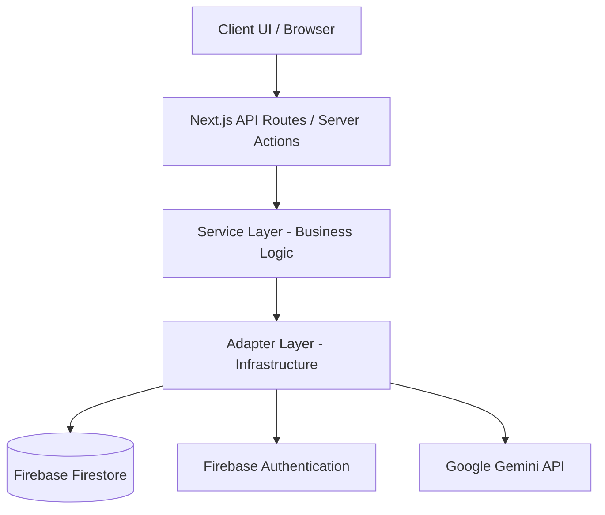
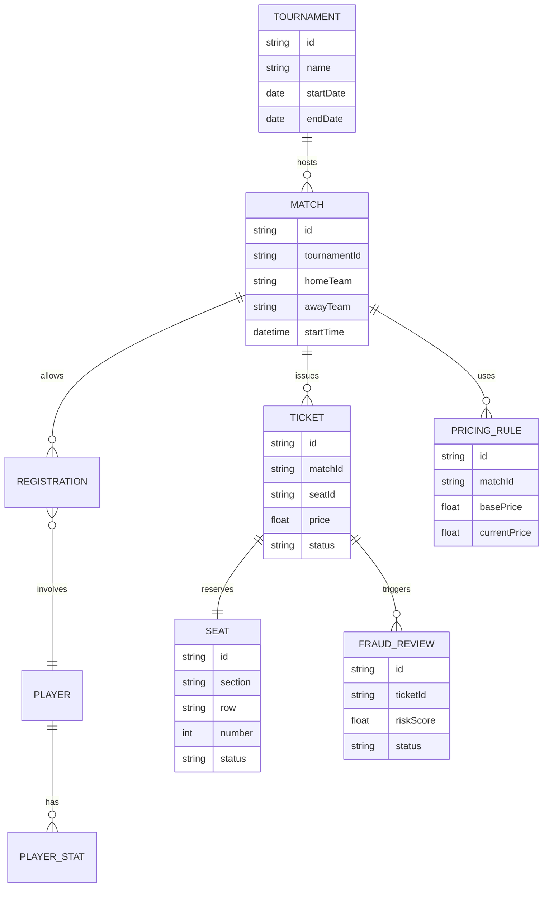
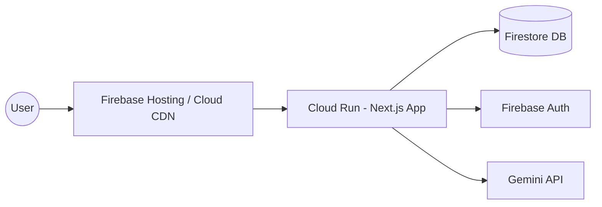

# System Architecture

## Overview
StadiumAI is built using a modern, scalable architecture designed around Next.js 15 App Router, React 19, and Google Cloud services. The application follows a strict layered architecture:

## Data Flow
1. **Presentation Layer**: React components (Server and Client) render the UI.
2. **API/Transport**: Next.js API Routes or Server Actions handle incoming requests, validating inputs via Zod.
3. **Service Layer**: Contains core business logic (e.g., pricing algorithms, seating recommendations).
4. **Adapter Layer**: Interfaces with external systems, ensuring the Service Layer remains decoupled from specific technologies (e.g., swapping a Mock DB for Firestore).

## Service Layer Architecture
Services are stateless classes or functions that encapsulate business rules. They only interact with infrastructure via Dependency Injection of Adapters.

## Adapter Pattern
The Adapter pattern is heavily used to isolate external APIs (Firebase, GCP, Gemini). Each external dependency has an interface defined in `src/types`, and both a `MockAdapter` and a `LiveAdapter` are provided in `src/adapters/`.

## Entity Relationship (ER) Diagram

## Deployment Architecture

